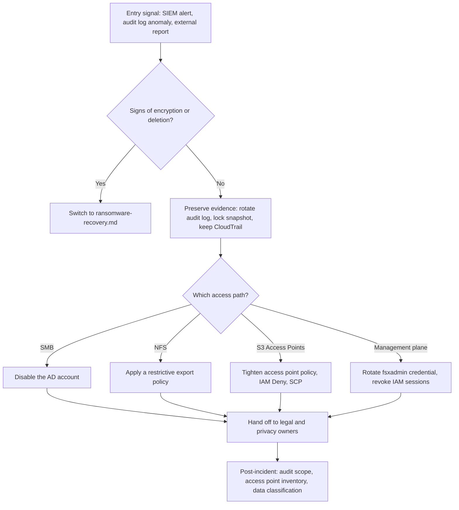

# Data Exfiltration Response Runbook

ファイルストアから大量に読み出された疑いがあるときの、証拠保全・経路の特定・封じ込め・引き継ぎの手順。
Steps for evidence preservation, path identification, containment and handoff when a file store may have been read out in bulk.

## 概要 / Overview

対象は、Amazon FSx for NetApp ONTAP のボリュームから SMB / NFS / S3 Access Points 経由で大量に読み出された疑いがある場合の初動である。暗号化・削除・上書きの兆候を伴う場合は [Ransomware Recovery Runbook](ransomware-recovery.md) に移る。Web アプリや DB 層の侵害そのものは扱わない（「本 runbook の対象外」の節）。本 runbook はガバナンス指針であり、通知・届出の要否などの法的判断はしない。

This runbook covers the first response when data may have been read out in bulk from Amazon FSx for NetApp ONTAP volumes through SMB, NFS or S3 Access Points. If there are signs of encryption, deletion or overwriting, switch to the [Ransomware Recovery Runbook](ransomware-recovery.md). A compromise of the web application or database layer itself is handled elsewhere (see "Out of Scope"). This runbook is governance guidance; it makes no legal judgement, such as whether a notification or report is required.

## 前提となる記録 / Prerequisite Logging

次の記録は、事前に有効にしておかないと遡れない。持ち出しの調査は、何が記録されているかで範囲が決まる。

These records cannot be reconstructed after the fact unless they were enabled in advance. What was recorded sets the limits of the investigation.

| 記録 / Record | 取れるもの / What it gives | 取れないもの / What it does not give | 根拠 / Evidence |
|---|---|---|---|
| ONTAP のファイルアクセス監査 / ONTAP file access auditing | SMB / NFS の操作、ユーザー、クライアント IP。記録されるのは監査 ACE（SACL）が付いたオブジェクトの操作なので、監査の有効化に加えて SACL の適用が要る / Operations, user and client IP for objects that carry audit ACEs (SACL) | SMB はオブジェクトごとに最初の read と最初の write だけを記録する [E-019]。そのため読み出し量の推定には使いにくい（推論） / SMB records only the first read and first write per object [E-019], so it is a weak basis for estimating volume read | documented（[file-access-auditing.html](https://docs.aws.amazon.com/fsx/latest/ONTAPGuide/file-access-auditing.html)）。SACL の要否は実測 2026-08-26、ONTAP 9.18.1P3D1 |
| FPolicy | NFS / SMB の操作の通知 / Notifications for NFS and SMB operations | S3 Access Points 経由の操作は FPolicy に届かない [E-015] / Operations through S3 Access Points do not reach FPolicy [E-015] | 実測 2026-08-26、ONTAP 9.18.1P3D1（[fpolicy-configuration.md](../ontap-native/fpolicy-configuration.md)） |
| S3 Access Points 経由の操作（ONTAP 監査ログ） / Operations through S3 Access Points (ONTAP audit log) | `Source=HTTP`（LIST は `Source=S3`）で、ファイル名・操作・オフセット・バイト数 / File name, operation, offset and bytes, with Source=HTTP (LIST: Source=S3) | 要求者の識別情報は記録されない [E-018] / The requesting principal is not recorded [E-018] | 実測 2026-08-26、ONTAP 9.18.1P3D1（[コンパニオンリポジトリの記録 / companion repository record](https://github.com/Yoshiki0705/FSx-for-ONTAP-Observability-integrations/blob/main/docs/ja/verification-results-fpolicy-s3ap-and-session.md)） |
| AWS CloudTrail | Amazon FSx API の呼び出し（要求者、送信元 IP、時刻） / Amazon FSx API calls with caller, source IP and time | S3 Access Points 経由のデータアクセスがデータイベントとしてどう記録されるかは、本リポジトリでは確認していない / How data access through S3 Access Points appears as data events has not been checked here | documented（[logging-using-cloudtrail-win.html](https://docs.aws.amazon.com/fsx/latest/ONTAPGuide/logging-using-cloudtrail-win.html)） |
| 監査ログの保存先 / Audit log destination | 下の 4 項目を参照 / See the four items below | 下の 4 項目を参照 / See the four items below | documented / テンプレートの確認 |

監査ログの保存先について、次の 4 点を前提にする。

The audit log destination rests on these four points.

- 保存先は `vserver audit create -destination` で指定するパスで、監査対象の SVM の名前空間に既にあるパスでなければならない（documented、[plan-auditing-config-concept.html](https://docs.netapp.com/us-en/ontap/nas-audit/plan-auditing-config-concept.html)）。本リポジトリのテンプレートとスクリプトは監査を設定しない。
  The destination is the path given to `vserver audit create -destination`, and it must already exist in the namespace of the audited SVM (documented). The templates and scripts in this repository do not configure auditing.
- テンプレートが作る `vol_audit`（`/audit`、SnapLock ではない、Snapshot ポリシー `default`）と `vol_snaplock`（`/compliance`、SnapLock Enterprise）は、どちらも `svm-audit` にある。上の規則により、どちらも `svm-prod` の監査ログの直接の保存先にはならない。`svm-prod` を監査するなら、保存先は `svm-prod` の中に用意する。
  The template's `vol_audit` (`/audit`, not SnapLock, snapshot policy `default`) and `vol_snaplock` (`/compliance`, SnapLock Enterprise) both live in `svm-audit`. By the rule above, neither can be the direct destination for `svm-prod` audit logs; prepare a destination inside `svm-prod` to audit it.
- 改ざんに耐える保管が要る場合の選択肢は 2 つある。(a) 保存先のボリュームで snapshot locking を有効にし、ロック付き Snapshot を取る（[tamperproof-snapshot.md](../ontap-native/tamperproof-snapshot.md)）。(b) ローテーション済みのファイルをクライアントから `vol_snaplock` へコピーして WORM にする。`vol_snaplock` は SnapLock Enterprise で、テンプレートは privileged delete を `PERMANENTLY_DISABLED` にしているが、Legal Hold は Compliance だけの機能で、Compliance と同じ保証ではない（documented、[how-snaplock-works.html](https://docs.aws.amazon.com/fsx/latest/ONTAPGuide/how-snaplock-works.html)）。
  Two options exist when tamper-resistant retention is needed. (a) Enable snapshot locking on the destination volume and take locked snapshots. (b) Copy rotated files from a client to `vol_snaplock` and commit them to WORM; it is SnapLock Enterprise with privileged delete set to `PERMANENTLY_DISABLED` by the template, but Legal Hold is a Compliance-only feature, so the guarantee is not the same as Compliance (documented).
- 他の文書で監査ログの保管に触れる場合も、この区別に従う（保存先は監査対象の SVM の中、改ざん耐性は (a) か (b) で別に作る）。
  Other documents that mention audit log retention follow the same distinction: the destination is inside the audited SVM, and tamper resistance is added separately with (a) or (b).

## 判断フローチャート / Decision Flowchart



## Phase 1: 疑いの入口 (Entry Signals)

入口は 3 つある。SIEM 側の行動分析のアラート（行動分析は SIEM に委ねる。コンパニオンリポジトリの範囲）、監査ログで見える読み取りの急増、外部からの連絡（取引先・利用者・第三者）。読み取りだけの持ち出しは ARP の検知の前提にないので、ARP のアラートを待たない [E-012]。

There are three entry signals: a behavioural alert from the SIEM (behavioural analysis is delegated to the SIEM, in the companion repository), a surge of reads visible in the audit log, and an external report from a partner, user or third party. Read-only exfiltration is not among ARP's detection premises, so do not wait for an ARP alert [E-012].

## Phase 2: 証拠保全 (Evidence Preservation)

手順は 4 つある。コマンドは手順の後にまとめて示す。

There are four steps; the commands follow the list.

1. 監査ログを保存先へ出し切る。ステージングにある記録を、ローテーションで変換済みのファイルにする。
   Flush the audit log to its destination by rotating it, so that staged records become converted files.
2. 保存先のボリュームで snapshot locking を有効にしている場合に限り、そのボリュームのロック付き Snapshot を取る。有効でないボリュームでは保持期間なしの通常の Snapshot になる（documented、[volume-snapshot-create.html](https://docs.netapp.com/us-en/ontap-cli/volume-snapshot-create.html)）。テンプレートの既定の構成ではどのボリュームも snapshot locking を有効にしていないので、この手順には事前の設定が要る（[tamperproof-snapshot.md](../ontap-native/tamperproof-snapshot.md)）。
   Only if snapshot locking is enabled on the destination volume, take a locked snapshot of it; on other volumes the result is an ordinary snapshot without retention (documented). The template's default configuration enables snapshot locking on no volume, so this step needs prior setup.
3. 証拠ファイルの SHA-256 マニフェストを作り、`vol_snaplock`（`/compliance`）へ置く。手順は [Ransomware Recovery Runbook](ransomware-recovery.md) の Phase 3「証拠保全 (Chain of Custody)」と同じなので、ここには複製しない。
   Create a SHA-256 manifest of the evidence files and place it on `vol_snaplock` (`/compliance`). The procedure is the same as Phase 3 of the Ransomware Recovery Runbook and is not duplicated here.
4. CloudTrail の該当期間を保全する。証跡（trail）の配信先の S3 バケットにあるログを、調査用の場所へコピーする。下の例は Event history で Amazon FSx の API を引く。
   Preserve CloudTrail for the period by copying the trail's log files from its S3 bucket to an investigation location. The example below queries Amazon FSx API calls in Event history.

```bash
ssh fsxadmin@<management-ip>

# Step 1: rotate the audit log so staged records are written to the destination
vserver audit rotate-log -vserver svm-prod-dev
# Confirm the audit configuration and the destination path
vserver audit show -vserver svm-prod-dev -instance

# Step 2: locked snapshot of the audit log destination volume
# (takes effect only when snapshot-locking-enabled is true on that volume)
volume snapshot create -vserver svm-prod-dev -volume <audit-log-volume> \
  -snapshot "exfil-evidence-<YYYYMMDD-HHMMSS>" \
  -snaplock-expiry-time "<MM/DD/YYYY HH:MM:SS>"
```

```bash
# Step 4: Amazon FSx API calls in CloudTrail Event history for the period
aws cloudtrail lookup-events \
  --lookup-attributes AttributeKey=EventSource,AttributeValue=fsx.amazonaws.com \
  --start-time "<YYYY-MM-DDTHH:MM:SSZ>" --end-time "<YYYY-MM-DDTHH:MM:SSZ>" \
  --region ap-northeast-1
```

## Phase 3: 経路の特定 (Path Identification)

経路ごとに、見る記録と要求者の分かり方が違う。S3 Access Points の経路では監査ログに要求者の識別情報が記録されないので [E-018]、IAM 側から許可した主体を洗い出す。

Each path has different records and a different way to identify the requester. On the S3 Access Points path the audit log does not record the requester [E-018], so work from the principals that IAM allows.

| 経路 / Path | 見る記録 / Records to read | 要求者が分かるか / Requester identifiable | 次の手 / Next step |
|---|---|---|---|
| SMB | ONTAP 監査ログ（`Source=CIFS`） / ONTAP audit log | ユーザー名とクライアント IP が監査レコードに入る（実測 2026-08-26） / User name and client IP are in the record (measured 2026-08-26) | AD アカウントの無効化（Phase 4） / Disable the AD account |
| NFS | ONTAP 監査ログ / ONTAP audit log | UID とクライアント IP が入る（推論。NFS では本リポジトリで確認していない） / UID and client IP (inference; not checked for NFS here) | export-policy の差し替え（Phase 4） / Replace the export policy |
| S3 Access Points | ONTAP 監査ログ（`Source=HTTP` / `Source=S3`）でファイルと操作。アクセスポイントポリシーと IAM のポリシー / ONTAP audit log for files and operations; access point and IAM policies | 監査ログに要求者の識別情報は記録されない [E-018]。アクセスポイントポリシーで許可した IAM 主体を洗い出す。CloudTrail での記録のされ方は本リポジトリでは確認していない / The audit log does not record the requester [E-018]; list the IAM principals the access point policy allows | アクセスポイントポリシーを絞る（Phase 4） / Tighten the access point policy |
| 管理面 / Management plane | CloudTrail の Amazon FSx API と IAM の操作、ONTAP の管理操作の監査ログ（`security audit log show`） / CloudTrail for Amazon FSx and IAM calls; ONTAP command audit log | CloudTrail は呼び出し元を記録する（documented） / CloudTrail records the caller (documented) | 認証情報の変更とセッションの失効（Phase 4） / Rotate credentials and revoke sessions |

## Phase 4: 封じ込め (Containment)

経路ごとに封じ込める。SVM の共有や export-policy に効く変更は、同じ SVM の業務すべてに影響する。対象を絞れない場合は、影響範囲を業務の担当と合意してから実行する。

Contain each path separately. Changes that act on an SVM's shares or export policy affect every workload on that SVM; if the change cannot be narrowed, agree the impact with the workload owners first.

- SMB: AD でアカウントを無効化する。NTFS ボリュームでは name-mapping の deny は SMB アクセスを遮断しない [E-002]。
  SMB: disable the account in AD. On NTFS volumes, a name-mapping deny does not block SMB access [E-002].
- NFS: [Ransomware Recovery Runbook](ransomware-recovery.md) Phase 2 の `quarantine_policy`（export-policy の差し替え）を使う。
  NFS: use the `quarantine_policy` export policy from Phase 2 of the Ransomware Recovery Runbook.
- S3 Access Points: アクセスポイントポリシーを絞る。既存のアクセスポイントのポリシーは S3 のコンソール・CLI・API で変更する（documented、[s3-ap-manage-access-fsxn.html](https://docs.aws.amazon.com/fsx/latest/ONTAPGuide/s3-ap-manage-access-fsxn.html)）。加えて、該当する IAM 主体に Deny を付けるか、SCP で止める。CLI の例はこの一覧の後にある。
  S3 Access Points: tighten the access point policy, which is changed for an existing access point with the S3 console, CLI or API (documented). Also attach a Deny to the IAM principals involved, or stop them with an SCP. The CLI example follows this list.
- 管理面: fsxadmin のパスワードを変更し、Secrets Manager の値も更新する。パスワードをコマンドラインやシェル履歴に残さない。IAM ロールの一時認証情報を失効させる（[id_roles_use_revoke-sessions.html](https://docs.aws.amazon.com/IAM/latest/UserGuide/id_roles_use_revoke-sessions.html)）。
  Management plane: change the fsxadmin password and update the Secrets Manager value, without leaving the password on a command line or in shell history. Revoke the IAM role's temporary credentials.

```bash
# S3 Access Points: read the current access point policy
aws s3control get-access-point-policy --account-id 123456789012 --name <access-point-name>

# Replace it with a restrictive policy prepared and reviewed in advance
aws s3control put-access-point-policy --account-id 123456789012 --name <access-point-name> \
  --policy file://restrictive-access-point-policy.json
```

## Phase 5: 引き継ぎと事後対応 (Handoff and Post-Incident)

法務・個人情報の担当へ、期間、経路、対象ボリューム、保全した証拠の場所を渡す。通知の要否・時期・方法の判断は法務の判断で、本 runbook の範囲の外にある（本 runbook はガバナンス指針であり、法的判断ではない）。再発防止として、監査の範囲（SACL を付けるパス）、アクセスポイントの棚卸し、ボリュームの `DataClassification` タグを見直す。

Hand the legal and privacy owners the period, the path, the volumes involved and where the preserved evidence is. Whether, when and how to notify is a legal decision outside this runbook (this runbook is governance guidance, not legal judgement). To prevent a recurrence, review the audit scope (which paths carry SACLs), the access point inventory and the volumes' `DataClassification` tags.

## 本 runbook の対象外 / Out of Scope

SQL インジェクション、API の認可不備、過剰なデータ返却、配布アプリに埋め込まれたキーなど、アプリ・DB 層の問題は、ストレージ層からは観測できない [E-013]。参照先として [AWS WAF](https://docs.aws.amazon.com/waf/latest/developerguide/) と [Amazon Inspector](https://docs.aws.amazon.com/inspector/latest/user/what-is-inspector.html) を置く。

Application and database layer problems, such as SQL injection, broken API authorisation, excessive data in responses and keys embedded in distributed apps, cannot be observed from the storage layer [E-013]. For those, see [AWS WAF](https://docs.aws.amazon.com/waf/latest/developerguide/) and [Amazon Inspector](https://docs.aws.amazon.com/inspector/latest/user/what-is-inspector.html).

## 関連ドキュメント / Related Documents

- [Cyber Resilience Framework Mapping（JA）](../ja/cyber-resilience-framework-mapping.md) / [EN](../en/cyber-resilience-framework-mapping.md): 持ち出し型のシナリオ、ストレージ層の境界 / the exfiltration scenario and the storage-layer boundary
- [Ransomware Recovery Runbook](ransomware-recovery.md)
- [運用上の注意事項 / Operational Considerations](../ja/operational-considerations.md)（[EN](../en/operational-considerations.md)）
- [Security Monitoring Design](../observability/security-monitoring-design.md)
- [AWS Backup Logically Air-Gapped Vault](../data-protection/aws-backup-logically-air-gapped-vault.md)
